# Jamie Smith's Portfolio

Here's an example of some of the public-facing collateral that I've put together over the past few years. It's not an exhaustive list, and as time passes some things might have been replaced or removed.

## Highlights

| Thumbnail | Details |
|---|---|
| [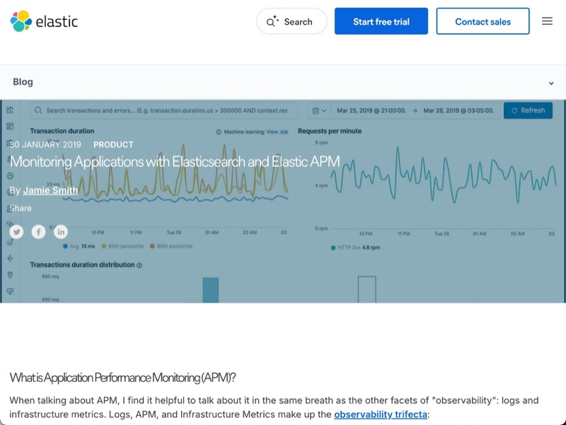](https://www.elastic.co/blog/monitoring-applications-with-elasticsearch-and-elastic-apm) | [**Monitoring Applications with Elasticsearch and Elastic APM**](https://www.elastic.co/blog/monitoring-applications-with-elasticsearch-and-elastic-apm) This [how-to blog](https://www.elastic.co/blog/monitoring-applications-with-elasticsearch-and-elastic-apm) (which was the overall top observability blog for both overall hits and time on page) was leveraged across the funnel- for onboarding, nurture flows, CTAs, etc. This blog helped kicked off an extremely successful APM awareness campaign.   **Outcomes**: <ul><li>Increased awareness of Elastic Observability as a complete APM solution</li><li>Expanded Elastic Cloud (Elastic's managed service) consumption for logging and metrics customers by ~25% year one</li><li>Helped to Elastic become recognized as a Visionary in their first appearance of the Gartner APM Magic Quadrant (2021)</li></ul>   |
| [**Elastic Observability Video**](https://www.youtube.com/watch?v=uCX24hRBULY/) 2021 I wrote the script, storyboarded the animations, and narrated this [Elastic Observability Overview video](https://www.youtube.com/watch?v=uCX24hRBULY), which was on the solution landing page for over a year | [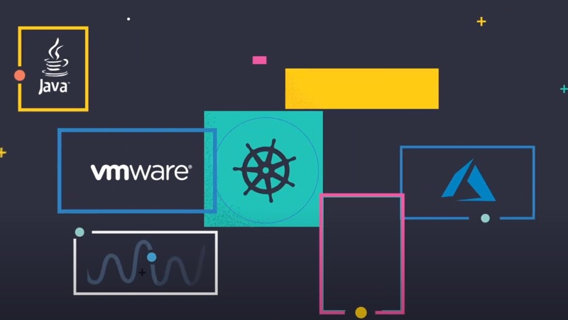](https://www.youtube.com/watch?v=uCX24hRBULY/) |
| [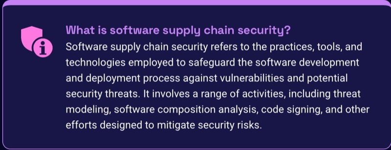](https://snyk.io/articles/software-supply-chain-security/) | [**Securing Your Modern Software Supply Chain**](https://snyk.io/articles/software-supply-chain-security/) This [article](https://snyk.io/articles/software-supply-chain-security/) about software supply chain security was used as a landing page in a successful GTM/ TOFU/MOFU campaign |
| [**Introduction to logging with the ELK/Elastic Stack**](https://www.elastic.co/webinars/intro-to-elk-for-logging) ~2020 [This](https://www.elastic.co/webinars/intro-to-elk-for-logging) was a fun one, focused on how to get started using the Elastic Stack for log and metrics analytics — the first steps on the path to observability.  I meticulously designed the presentation for this webinar so it could be packaged up for reuse. I presented it multiple times on webinars, and several SEs presented it themselves. It was used in meetups, customer events, and at the demo booths at conferences.  Talk about value from one piece of content!|[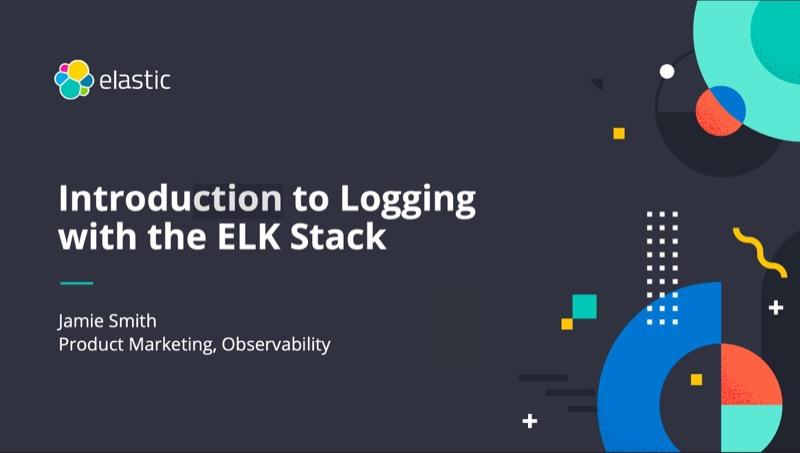](https://www.elastic.co/blog/monitoring-applications-with-elasticsearch-and-elastic-apm)|
|  | [**Going beyond reachability to prioritize what matters most**](https://snyk.io/blog/Reachability-for-vuln-prioritization/) October 1, 2024 This was one of the cornerstone pieces for the "Holistic risk-based prioritization" campaign. Reachability is one signal, but not the only signal (and probably not the most important) |

## Product/Solution Pages
(Note that it's likely that these will get changed in the future, but accurate as of August 5, 2025)

| Thumbnail | Details |
|---|---|
| [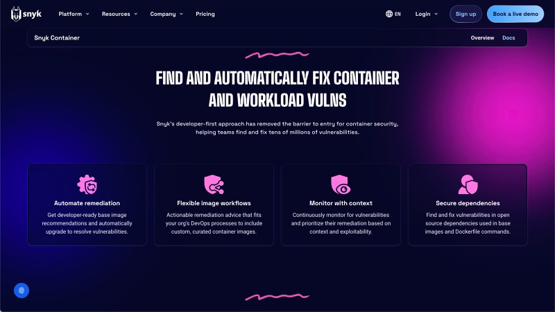](https://snyk.io/product/container-vulnerability-management/) | [**The Snyk Container Security landing page**](https://snyk.io/product/container-vulnerability-management/) This also had a one-pager layout for events |
| [**The Software Supply Chain Security Solution landing page**](https://snyk.io/solutions/software-supply-chain-security/) we also created a one-pager variant of this page which was used as a virtual handout for webinars  | [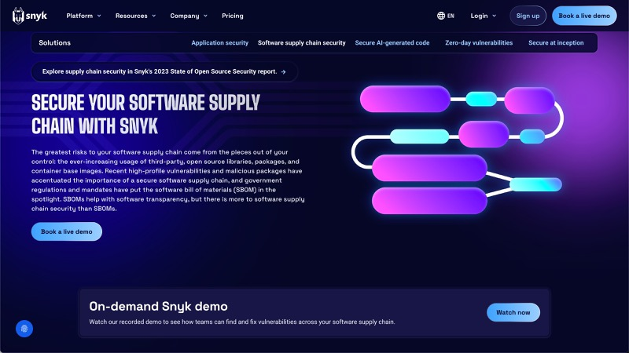](https://snyk.io/solutions/software-supply-chain-security/) |

## Other Webinars

| Thumbnail | Details |
|---|---|
| [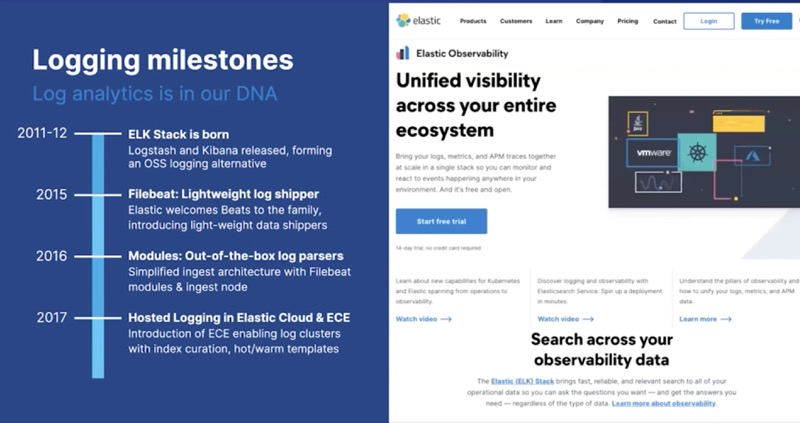](https://www.elastic.co/elasticon/archive/2021/solution-series/emea/evolution-of-logging-with-the-elastic-stack) | [**Evolution of logging with the Elastic Stack**](https://www.elastic.co/elasticon/archive/2021/solution-series/emea/evolution-of-logging-with-the-elastic-stack) The Elastic Stack (or ELK Stack) had long been an enterprise standard for centralized logging, but they continued evolving the platform.  This was part the ElasticON tour, conferences for customers and users |
| [**Combining logs, metrics, and traces for unified observability**](https://www.elastic.co/elasticon/archive/2021/event/north-america/combining-logs-metrics-and-traces-for-unified-observability) This was part of a launch event. When Elastic started marketing an "observability solution", the term "Observability" wasn't yet widely used (in fact, Gartner still just calls all of it "APM"). This was one of the first events that we actually leaned in on the term | [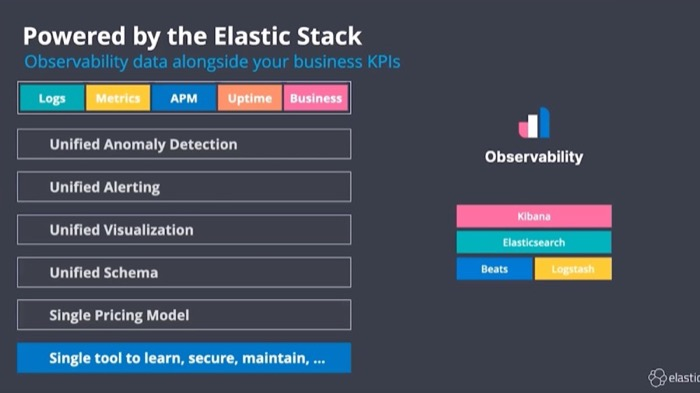](https://www.elastic.co/elasticon/archive/2021/event/north-america/combining-logs-metrics-and-traces-for-unified-observability) |
| [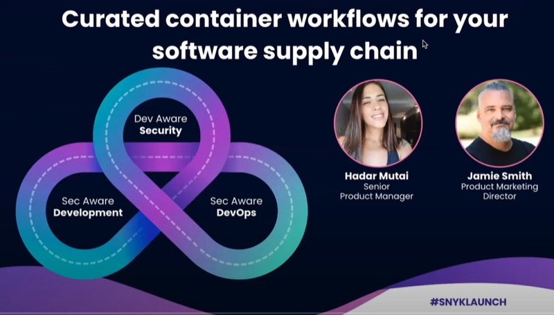](https://snyk.io/videos/snyklaunch-april-2023-container/) | [**SnykLaunch April 2023 - Curated container security workflows**](https://snyk.io/videos/snyklaunch-april-2023-container/) April 4, 2023 This was a launch webinar for Snyk's Custom Base Image Recommendations, where I served as the SME with the product manager, to help spread awareness of a new feature that extended what was, at the time, Snyk Container's key differentiator. I also wrote a post-launch blog, [SnykLaunch recap: Custom Base Image Recommendations](https://snyk.io/blog/snyklaunch-recap-custom-base-image-recommendations/) |

## Other Blogs

Again, likely not exhaustive. I can already see that some have been removed (while I think that some had the author changed)

| Thumbnail | Details |
|---|---|
|  | [**Snyk-Generated SBOMs Now Include License Details for the Open Source Libraries in Your Projects**](https://snyk.io/blog/include-license-info-in-your-sboms/) December 9, 2024 Snyk now includes license information in its generated SBOMs, giving developers a clearer picture of their application's components and associated license risks and simplifying compliance and security… |
| [**2024 Open Source Security Report: Slowing Progress and New Challenges for DevSecOps**](https://snyk.io/blog/2024-open-source-security-report-slowing-progress-and-new-challenges-for/) December 3, 2024 Read top-level findings from Snyk’s 2024 Open Source Security Report, exploring slowing progress and new challenges for DevSecOps. |  |
|  | [**Going beyond reachability to prioritize what matters most**](https://snyk.io/blog/Reachability-for-vuln-prioritization/) October 1, 2024 While static reachability can help teams better understand their app vulnerabilities, they must be paired with other types of context and risk insights. |
| [**Weak Hash vulnerability discovered in crypto-js and crypto-es** (CVE-2023-46233 & CVE-2023-46133)](https://snyk.io/blog/weak-hash-vulnerability-crypto-js-crypto-es/) October 25, 2023 Learn how to find and fix the new "Use of Weak Hash" vulnerability in crypto-js and crypto-es that was reported on October 18, 2023. | [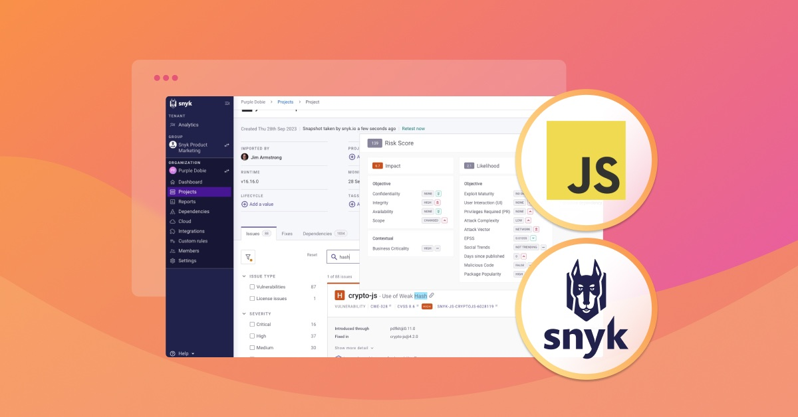](https://snyk.io/blog/weak-hash-vulnerability-crypto-js-crypto-es/) |
|  | [**Find and fix HTTP/2 rapid reset zero-day vulnerability** CVE-2023-44487](https://snyk.io/blog/find-fix-http-2-rapid-reset-zero-day-vulnerability-cve-2023-44487/) October 11, 2023 HTTP/2 rapid reset vulnerability is being tracked as CVE-2023-44487, assigned High severity. Learn about the vulnerability, and how to find and fix with Snyk. |
| [**Developer-first supply chain security**](https://snyk.io/blog/developer-first-supply-chain-security/) September 19, 2023 Developer-first supply chain security aims to minimize the risk of potential breaches, streamline the development workflow, foster collaboration, and instill a culture of vigilance. |  |
|  | [**Software Supply Chain Security Tools: Types, Features & Considerations**](https://snyk.io/blog/supply-chain-security-tools-guide/) August 2, 2023 Software supply chain security tools provide a range of features to identify and mitigate potential risks and vulnerabilities in your supply chain. |
| [**Secrets Management: Tools & Best Practice**](https://snyk.io/blog/secrets-management/) June 26, 2023 As applications and projects scale, so will the number of secrets you need to keep safe. Learn the best practices and tools to use to secure your secrets. |  |
|  | [**How to implement DevSecOps in 4 steps: DevSecOps implementation strategy**](https://snyk.io/blog/4-steps-to-implement-devsecops/) June 22, 2023 Learn more about the best ways and strategies to implement DevSecOps in 4 steps. |
| [**High profile AWS breaches & how to avoid them**](https://snyk.io/blog/aws-security-breaches/) June 7, 2023 Companies like Capital One, Twilio, and Uber have all suffered from AWS breaches. Learn from their experiences and prevent the next breach from happening to you. |  |
|  | [**Lessons from OpenSSL vulnerabilities part 1: Preparing your supply chain for the next critical vulnerability**](https://snyk.io/blog/lessons-from-openssl-vulnerabilities-part-1/) April 19, 2023 In this two part series, we'll walk through some of the things you need to consider when finding instances of a vulnerability in your software supply chain. Let’s begin by discussing where you’ll need… | 
| [**Lessons from OpenSSL vulnerabilities part 2: Finding and fixing supply chain vulnerabilities**](https://snyk.io/blog/lessons-from-openssl-vulnerabilities-part-2/) April 26, 2023 This supply chain series centers on the lessons learned from OpenSSL and what you need to consider when enhancing your supply chain security. Let’s dive into part two and discuss how to find — and mor… |  |
|  | [**SnykLaunch recap: Custom Base Image Recommendations**](https://snyk.io/blog/snyklaunch-recap-custom-base-image-recommendations/) April 4, 2023 One of the exciting new features discussed at SnykLaunch today was Custom Base Image Recommendations (CBIR). Read on for all the details. |
| [**Top AWS Security Risks & Prevention**](https://snyk.io/blog/aws-security-risks-prevention/) March 1, 2023 Check out the top 10 challenges and risks to your AWS security. Follow our best practices to secure your AWS deployments and avoid security mistakes or misconfigurations. |  |
|  | [**Three ways Snyk made software supply chains more secure in 2022**](https://snyk.io/blog/snyk-software-supply-chain-security-2022-review/) January 12, 2023 In 2022, Snyk continued to expand on our developer-centric approach to software security, by adding several key enhancements to the existing solutions — let's focus on three key capabilities introduce… |
| [**What's new in Elastic Observability 7.13:** Native Azure console integration, Fleet Server, and enhanced APM workflows](https://www.elastic.co/blog/whats-new-elastic-observability-7-13-0) 25 May 2021 Elastic Observability 7.13 adds native integration in Azure console, the new Fleet Server, new troubleshooting views in Elastic APM, and more... | [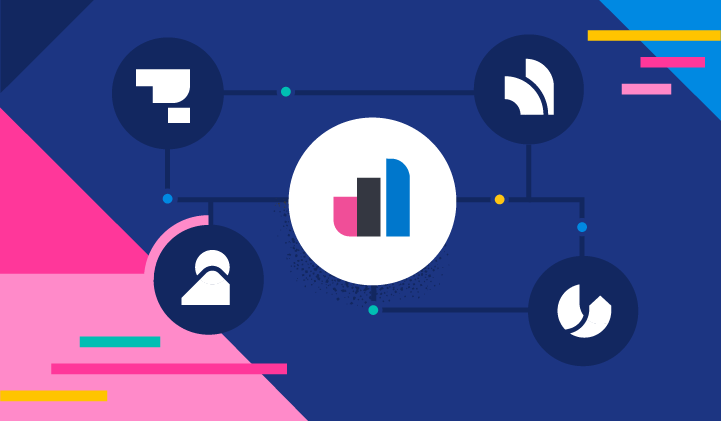](https://www.elastic.co/blog/whats-new-elastic-observability-7-13-0) |
|  | [**Getting started with free and open Elastic Observability**](https://www.elastic.co/blog/getting-started-with-free-and-open-elastic-observability) 21 April 2021 Learn how to get started with free and open Elastic Observability, including downloading, installing, enabling security, and loading sample data... |
| [**How to monitor containerized Kafka with Elastic Observability**](https://www.elastic.co/blog/how-to-monitor-containerized-kafka-with-elastic-observability) 24 March 2021 Learn how to monitor your containerized Kafka cluster with Elastic Observability, including logs and metrics... | [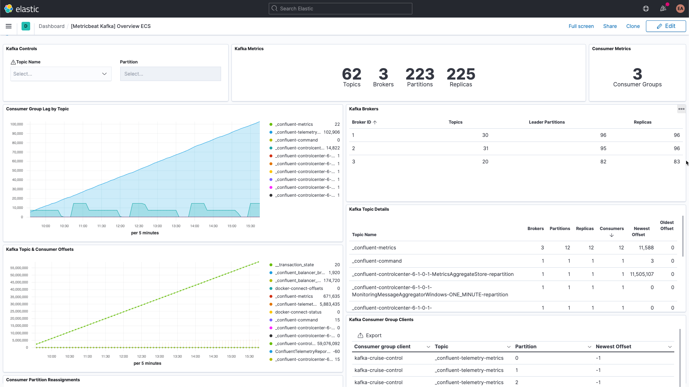](https://www.elastic.co/blog/how-to-monitor-containerized-kafka-with-elastic-observability) |
|  | [**Ingesting metrics securely using role-based access control (RBAC)**](https://www.elastic.co/blog/ingesting-metrics-securely-elastic-stack-role-based-access-control-rbac) 09 June 2020 You've identified the systems metrics you need to monitor, and you've consolidated them into the Elastic Stack. In this final post in the series, we're going to make sure they stay secure in Elasticse… |
| [**Identifying and monitoring key metrics for your hosts and systems**](https://www.elastic.co/blog/identifying-and-monitoring-key-metrics-for-your-hosts-and-systems) 27 May 2020 Infrastructure monitoring (metrics) is a key part of observability, but do you know which metrics you should be monitoring? In part 1 of this series on metrics with the Elastic Stack, learn what stats… |  |
|  | [**KubeCon 2019:  Elastic Doubles Down on Observability and Orchestration for Kubernetes**](https://www.elastic.co/blog/kubecon-2019-elastic-doubles-down-on-observability-and-orchestration-for-kubernetes) 19 November 2019 As users adopt Kubernetes initiatives, Elastic products move fast to support their evolving needs. Whether you are trying to migrate Elasticsearch workloads to Kubernetes or want to gain better visibi… |
| [**Elastic APM 7.2.0 released**](https://www.elastic.co/blog/elastic-apm-7-2-0-released) 25 June 2019 Elastic APM 7.2.0 released, including the beta .NET agent, expanded agent metrics, WebLogic and JBoss support, and support for multiple environments... | [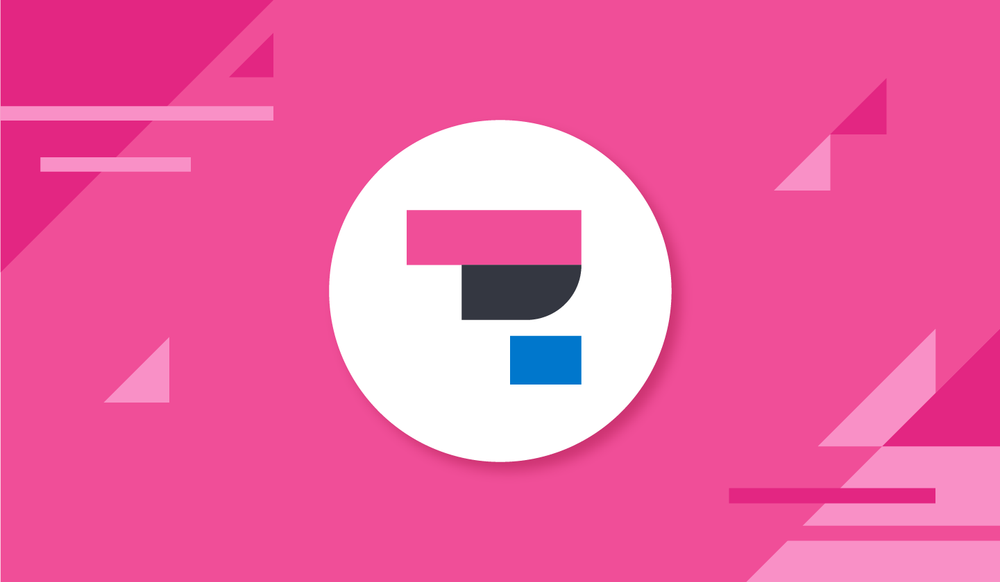](https://www.elastic.co/blog/elastic-apm-7-2-0-released) |
|  | [**Elastic Logs 7.2.0 released**](https://www.elastic.co/blog/elastic-logs-7-2-0-released) 25 June 2019 Elastic Logs 7.2.0 released with improved support for structured logs, customizable column views, new NATS and CoreDNS modules, and CRI-O container log input... |
| [**Elastic Infrastructure 7.2.0 released**](https://www.elastic.co/blog/elastic-infrastructure-7-2-0-released) 25 June 2019 Elastic Infrastructure 7.2.0 released with Metrics Explorer to quickly build and break down time-series visualizations,  plus module for CNCF CoreDNS metrics... |  |
|  | [**Elastic Infrastructure 7.0 released**](https://www.elastic.co/blog/elastic-infrastructure-7-0-0-released) 10 April 2019 Version 7.0 of the Elastic Stack brings you increased observability into your entire application stack, with new modules (NATS, Microsoft SQL Server, CouchDB, and AWS EC2), an improved Prometheus modu… |
| [**Monitoring Applications with Elasticsearch and Elastic APM**](https://www.elastic.co/blog/monitoring-applications-with-elasticsearch-and-elastic-apm) 30 January 2019 Application Performance Monitoring (APM) lets see what's going on inside your application, and helps increase the observability of your entire application stack.  Elastic APM increases the observabili… |  |
|  | [**Tutorial: Getting Started on Elastic Cloud with a Sample Dataset for hosted Elasticsearch and the Elastic Stack**](https://www.elastic.co/blog/getting-started-with-hosted-elasticsearch-and-a-sample-dataset) 25 May 2018 This step-by-step set of instructions will walk you through setting up an Elastic Cloud account, creating and securing a Elasticsearch cluster, importing data, and visualizing it in Kibana.... |
| [**Here to Help... (An Elastic{ON} Canvas Story)**](https://www.elastic.co/blog/elasticon-kibana-canvas-story-ama) 28 March 2018 ... | [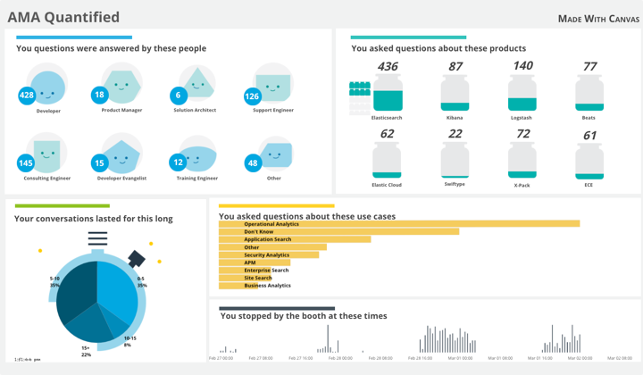](https://www.elastic.co/blog/elasticon-kibana-canvas-story-ama) |
|  | [**But First, Coffee... (An Elastic{ON} Canvas Story)**](https://www.elastic.co/blog/elasticon-kibana-canvas-story-elasticoffee) 14 March 2018 See how we used Elasticsearch, Kibana, Canvas, and IoT to track beverage metrics at Elastic{ON)...   This was actually one of my favorite blogs of all time. This is what introduced me to home automation! |
| [**Monitor Your System with Metricbeat and Elastic Cloud**](https://www.elastic.co/blog/ship-metrics-with-metricbeat-to-hosted-elasticsearch-elastic-cloud) 07 September 2017 Learn how to create hosted Elasticsearch deployment s, add users, create Kibana dashboards, and ship system metrics with Metricbeat.... | [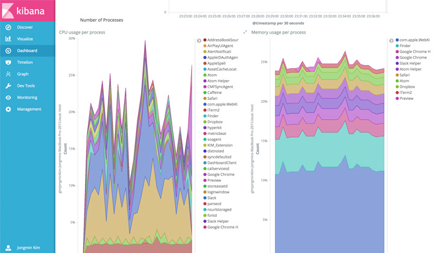](https://www.elastic.co/blog/ship-metrics-with-metricbeat-to-hosted-elasticsearch-elastic-cloud) |

